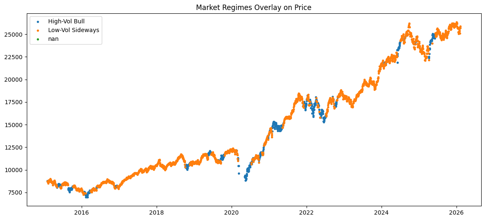

# Market Regime Analysis — NIFTY 50

This project analyzes **market regimes in the NIFTY 50 index** using a combination of
rule-based methods and unsupervised machine learning (K-Means clustering).

The goal is to identify different market environments (regimes), study their persistence,
and evaluate how returns, volatility, and risk behave across regimes.

## Project Highlights

- End-to-end data pipeline (raw → clean → features → regimes)
- Rule-based volatility regimes
- Unsupervised regime detection using **K-Means clustering**
- Regime persistence & transition analysis
- Portfolio-ready visualizations and insights

## Data

- **Source:** Yahoo Finance (via `yfinance`)
- **Instrument:** NIFTY 50 (`^NSEI`)
- **Frequency:** Daily
- **Period:** 2015 – Present

## Project Structure

market_regime_analysis/
├── data/
│ ├── raw/
│ ├── clean/
│ └── features/
├── notebooks/
│ ├── 01_data_cleaning.ipynb
│ ├── 02_feature_engineering.ipynb
│ ├── 03_market_regimes.ipynb
│ └── 04_dashboard.ipynb
├── assets/
│ └── market_regimes_overlay.png
└── README.md

## Methodology

### 1️.Feature Engineering
- Daily returns
- Log returns
- Rolling volatility (20-day)

### 2️.Rule-Based Regimes
- Market classified into **High Volatility** and **Low Volatility**
- Threshold based on rolling volatility median

### 3️.Machine Learning Regimes
- Features standardized using `StandardScaler`
- **K-Means clustering (k = 2)** applied
- Regimes interpreted as:
  - Stable / Low-risk market
  - Volatile / High-risk market

### 4️.Regime Persistence
- Duration analysis of each regime
- Transition probability matrix to understand regime stability

## Key Visualization

### Market Regimes Overlayed on Price

This chart highlights how different market regimes align with price movements,
clearly showing periods of elevated risk and stability.

## Regime Summary Insights

- High-volatility regimes exhibit:
  - Higher volatility
  - Larger drawdowns
  - Shorter persistence
- Low-volatility regimes are:
  - More persistent
  - Lower risk
  - Better suited for long-term positioning

## Tools & Libraries

- Python
- pandas, numpy
- matplotlib
- scikit-learn
- Jupyter Notebook

## Why This Project Matters

This project demonstrates:
- Strong data cleaning & feature engineering skills
- Practical application of machine learning in finance
- Ability to translate analysis into actionable insights
- Clean project structure suitable for real-world analytics work

## Future Improvements

- Add macro indicators (VIX, interest rates)
- Try HMM-based regime detection
- Backtest regime-based trading strategies